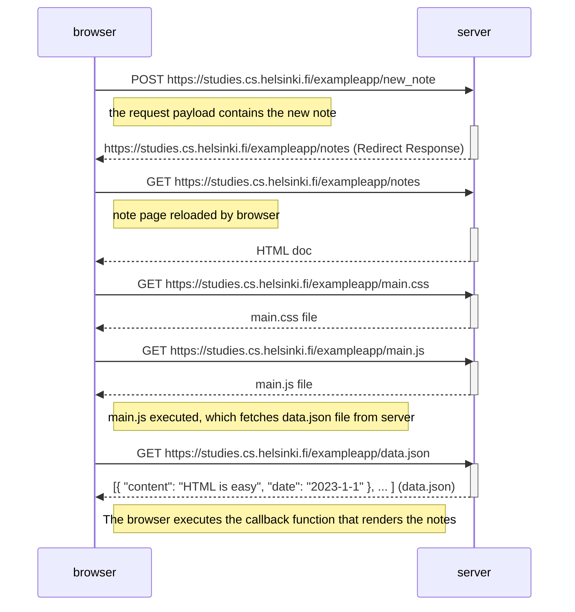

```mermaid
    sequenceDiagram
    participant browser
    participant server

    browser->>server: POST https://studies.cs.helsinki.fi/exampleapp/new_note
    Note right of browser: the request payload contains the new note
    activate server
    server-->>browser: https://studies.cs.helsinki.fi/exampleapp/notes (Redirect Response)
    deactivate server
    
    browser->>server: GET https://studies.cs.helsinki.fi/exampleapp/notes
    Note right of browser: note page reloaded by browser
    activate server
    server-->>browser: HTML doc
    deactivate server
    
    browser->>server: GET https://studies.cs.helsinki.fi/exampleapp/main.css
    activate server
    server-->>browser: main.css file
    deactivate server
    
    browser->>server: GET https://studies.cs.helsinki.fi/exampleapp/main.js
    activate server
    server-->>browser: main.js file
    deactivate server
    
    Note right of browser: main.js executed, which fetches data.json file from server
    
    browser->>server: GET https://studies.cs.helsinki.fi/exampleapp/data.json
    activate server
    server-->>browser: [{ "content": "HTML is easy", "date": "2023-1-1" }, ... ] (data.json)
    deactivate server    

    Note right of browser: The browser executes the callback function that renders the notes 
```