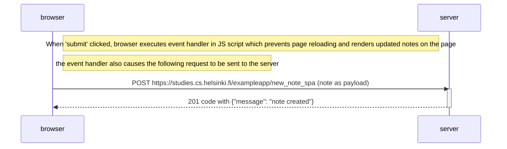

```mermaid
    sequenceDiagram
    participant browser
    participant server

    Note right of browser: When 'submit' clicked, browser executes event handler in JS script which prevents page reloading and renders updated notes on the page
    Note right of browser: the event handler also causes the following request to be sent to the server

    browser->>server: POST https://studies.cs.helsinki.fi/exampleapp/new_note_spa (note as payload)
    activate server
    server-->>browser: 201 code with {"message": "note created"}
    deactivate server
```